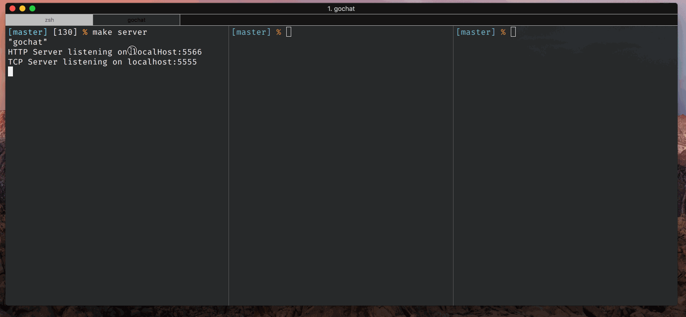
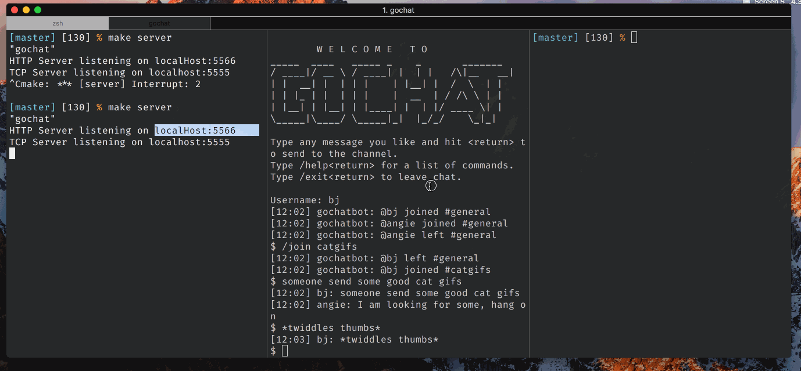

# gochat

Basic client-server chat program working over Telnet and HTTP.

#### Multi-client chat over TCP with channel support

#### HTTP support for getting channel list, channel messages, and posting a message to a channel

## Features

* [x] Chat Server
* [x] Config settings read from local config file (port, ip, log file)
* [x] Multiple client connections via telnet to send messages to the server
* [x] All messages logged locally
* [x] Optional: Support rooms/channels
* [x] Relay new messages to all clients with timestamp and username
* [x] Optional: Rest API to read messages
* [x] Optional: Rest API to post messages
